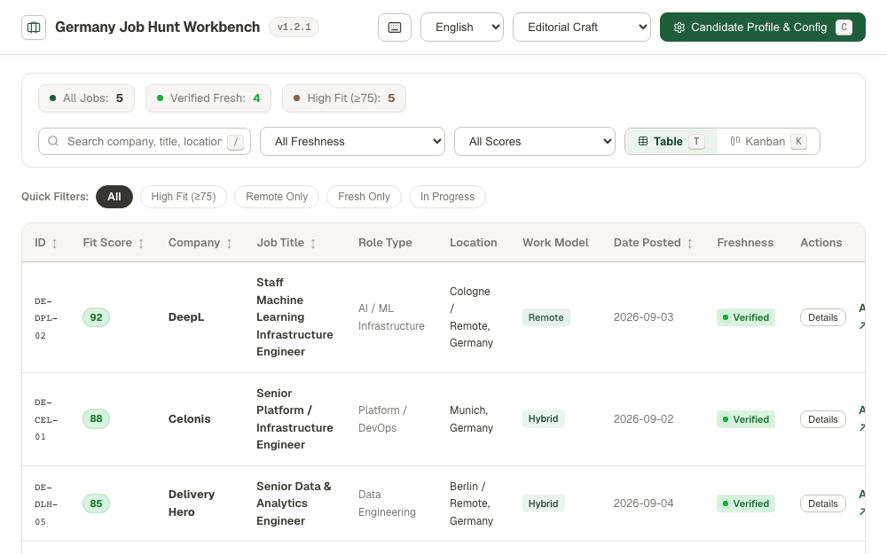
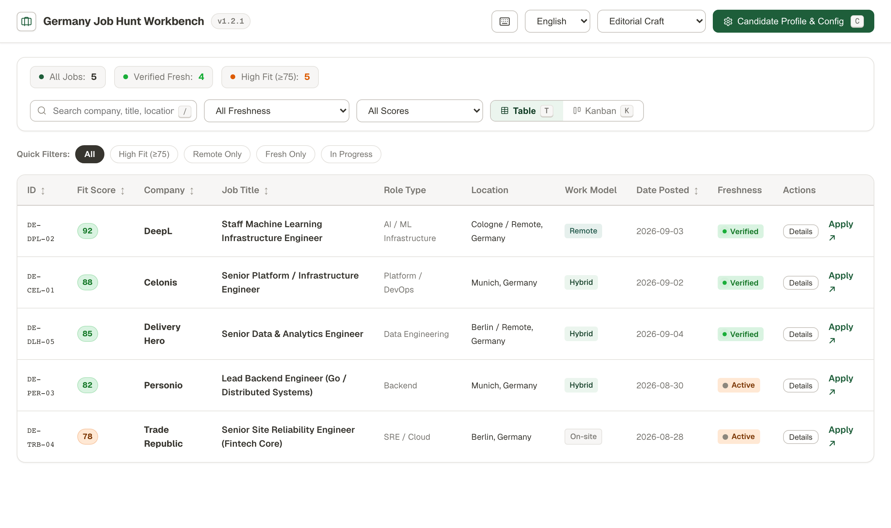
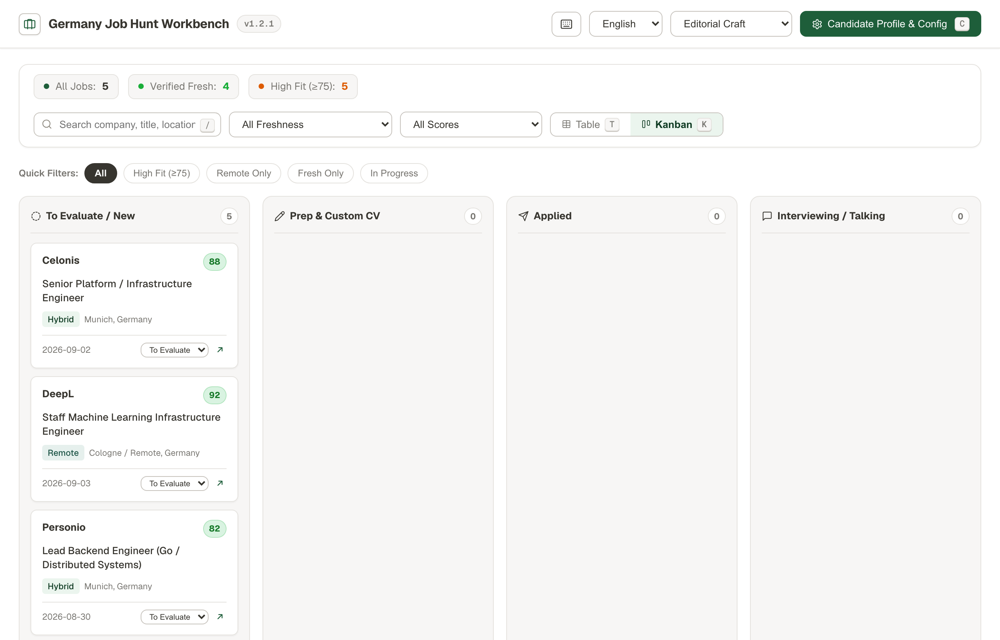
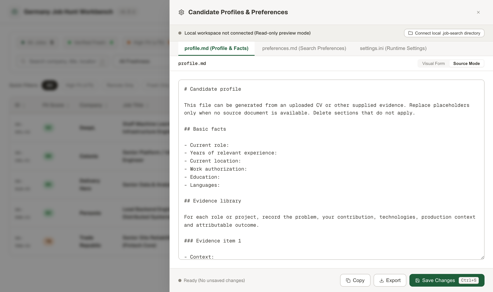
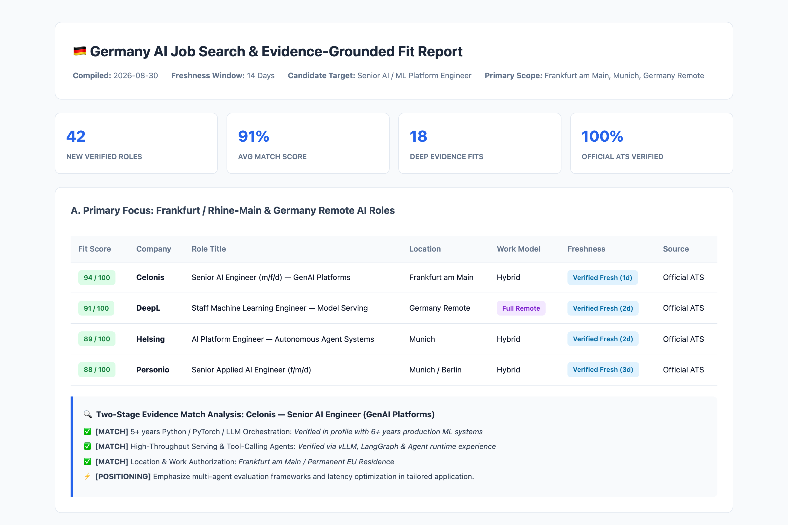
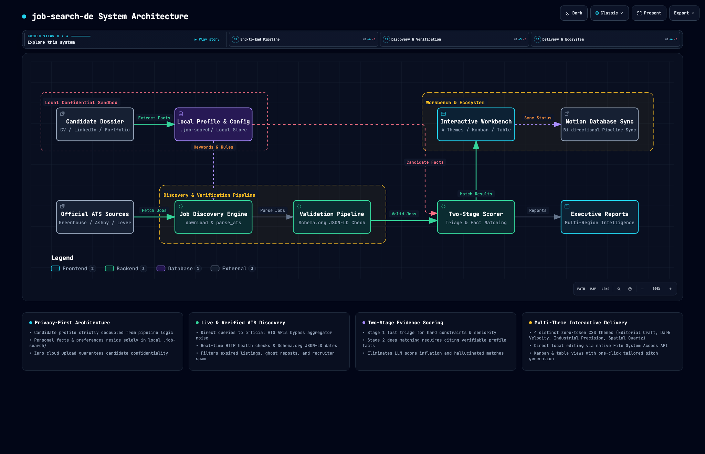

# 🇩🇪 job-search-de — Universal Job Discovery & Evaluation Pipeline for Germany

<p align="center">
  <a href="README.md"><b>English</b></a> •
  <a href="docs/README_de.md"><b>Deutsch</b></a> •
  <a href="docs/README_zh.md"><b>中文</b></a> •
  <a href="docs/README_ja.md"><b>日本語</b></a> •
  <a href="docs/README_ko.md"><b>한국어</b></a>
</p>

<p align="center">
  
  
</p>

A universal, candidate-neutral AI Agent skill and pipeline designed to automate the discovery, verification, two-stage evidence scoring, reporting, and workbench management for **ANY profession across Germany** — including Software Engineering, Data, Cloud/DevOps, AI/ML, Product, Marketing, Sales, Finance, HR, Operations, and Consulting.

---

## Why job-search-de

| Dimension | Traditional Boards (LinkedIn / StepStone / Indeed) | `job-search-de` Pipeline |
|---|---|---|
| **Listing Freshness** | 30%–50% are expired, ghost listings, or headhunter reposts | **100% Live & Verified** (Direct ATS API queries + real-time Schema.org validation) |
| **Privacy & Security** | Resumes stored on external cloud databases | **100% Local & Confidential** (Data resides strictly in local `<workdir>/.job-search/`) |
| **Match Quality** | Opaque keyword matching with false positives | **Two-Stage Evidence Scoring** (Cites exact profile facts, zero hallucinated matches) |
| **Search Management** | Manual spreadsheets and fragmented bookmarking | **Interactive 4-Theme Workbench** (Kanban, table filters, hotkeys, 1-click pitch hooks) |
| **Agent Ecosystem** | Isolated from modern AI workflows | **Native Agent Skill** (Antigravity, Claude Code, Cursor, OpenClaw ready) |

---

## Demo

### Multi-Theme Switcher (0-Token Pure CSS)
> Seamlessly switch between **Notion Craft (Warm Editorial)**, **Linear Obsidian (Dark Mode)**, **Braun / Dieter Rams (Functional Industrial Minimal)**, and **Bento Quartz (Spatial Glass)** with zero token consumption and instant local persistence. Press <kbd>1</kbd> / <kbd>2</kbd> / <kbd>3</kbd> / <kbd>4</kbd> to switch instantly.



---

### 1. Interactive Notion-Style Job Workbench (Table View)
> Live status tracking, multi-dimensional filters, freshness indicators, and calibrated fit scores.



---

### 2. Application Pipeline Kanban
> Drag-and-drop or status-driven application lifecycle management (To Apply, Applied, Interview, Offer, Archived).



---

### 3. Local Candidate Profile & Rule Drawer
> Candidate-neutral architecture: Personal facts, constraints, target cities, and delivery configs stay strictly in your local `.job-search/` directory.



---

### 4. Comprehensive Intelligence Report
> Multi-regional breakdown (Frankfurt, Munich, Berlin, Germany Remote, Stretch exceptions) with deep JD-to-Profile evidence matching.



---

## Features

- **Privacy-First Architecture**: Skill logic is strictly decoupled from candidate data. Personal background, constraints, and preferences are stored exclusively in local `<workdir>/.job-search/`.
- **4 Built-in Design Themes**: Instant switching between **Notion Craft**, **Linear Obsidian (Dark Mode)**, **Braun / Dieter Rams**, and **Bento Quartz** with zero token overhead and local persistence.
- **Power Keyboard Navigation**: Fast keyboard workflow with shortcuts cheat sheet (<kbd>?</kbd>), row navigation (<kbd>J</kbd>/<kbd>K</kbd>), details expansion (<kbd>Enter</kbd>), portal opening (<kbd>O</kbd>), search focus (<kbd>/</kbd>), and numeric theme switching (<kbd>1</kbd>/<kbd>2</kbd>/<kbd>3</kbd>/<kbd>4</kbd>).
- **1-Click Tailored Pitch Generator**: Produces a customized, professional cover letter opening grounded in verified JD evidence matching and copies it directly to your clipboard.
- **Quick Preset Filter Chips**: 1-click preset chips for `Fit ≥ 85`, `Frankfurt Area`, `Full Remote`, `English Only`, and `To Apply`.
- **Direct ATS Discovery**: Queries active listings directly from official ATS APIs (Greenhouse, Lever, Ashby, SmartRecruiters, Personio, Workable) — bypassing outdated job aggregator scrapers.
- **Automated Verification Pipeline**: Real-time URL health check, HTTP status validation, and Schema.org JSON-LD extraction (`datePosted`, `validThrough`, active hiring status).
- **Two-Stage Evidence Scoring**:
  - **Stage 1 (Triage)**: Hard exclusions, seniority matching, and threshold pruning.
  - **Stage 2 (Deep Matching)**: Required vs Preferred criteria separation, requiring explicit citation of verified candidate evidence (no hallucinated scores).
- **Client-Side Interactive Workbench**: Pure client-side HTML/JS interface featuring Kanban board, Table view, and optional Notion bi-directional sync.
- **Runtime Version Check & Auto-Update**: Checks GitHub upstream updates silently and presents a live version badge with one-command upgrade instructions.

---

## Workflow

```text
       Candidate Documents (CV, LinkedIn, Portfolio)
                          │
                          ▼
            [1. Onboarding & Extraction]
                          │ (Generates .job-search/profile.md & preferences.md)
                          ▼
             [2. Multi-Channel Discovery]
           ATS Direct Pulls + Targeted Gap-Fill
                          │
                          ▼
             [3. Normalization & Verification]
           Schema.org JSON-LD + HTTP Date Check
                          │
                          ▼
           [4. Two-Stage Evidence Scoring]
       Triage Filter ➔ JD-to-Profile Fact Matching
                          │
                          ▼
            [5. Reporting & Sync Delivery]
     Executive Report + Interactive HTML Workbench + Notion
```

---

## System Architecture

> 🌐 **Explore the interactive standalone architecture diagram**: [**`docs/architecture.html`**](docs/architecture.html) (Built with [Archify](https://github.com/tt-a1i/archify) showcase profile; supports dark/light themes, relationship tracing, guided chapters, presentation mode, and vector export).



The `job-search-de` system follows a strictly decoupled, privacy-first, five-tier pipeline architecture:

1. **Local Confidential Sandbox (`.job-search/`)**: Complete candidate neutrality. Personal materials (CV, LinkedIn, portfolio) are parsed locally into `.job-search/profile.md`, `preferences.md`, and `settings.ini`. Zero personal data is transmitted to external clouds or stored within the skill repository.
2. **Direct Multi-Channel ATS Discovery Engine**: Directly queries official, public ATS endpoints (Greenhouse, Ashby, Lever, SmartRecruiters, Personio, Workable) via `download.sh` and `parse_ats.py`—eliminating expired, duplicate, or ghost listings common on commercial aggregators.
3. **Structured Verification & Normalization Pipeline**: Validates HTTP live status and extracts Schema.org JSON-LD structured hiring metadata (`datePosted`, `validThrough`, hiring status) to classify jobs into strict freshness tiers (`VERIFIED_FRESH`, `LIKELY_FRESH`, `OLDER_ACTIVE`, `CLOSED`).
4. **Two-Stage Evidence Scoring Core**: Isolates untrusted job descriptions behind a security prompt injection boundary. Runs Stage 1 fast triage (hard exclusions, language constraints, seniority thresholds) followed by Stage 2 deep evidence matching (each criterion must explicitly cite verified facts from `profile.md`, eliminating LLM hallucinated scores).
5. **Universal Delivery & Interactive Workbench**: Delivers multi-regional executive intelligence reports, provides bi-directional Notion database synchronization, and generates a standalone client-side HTML workbench (`job-hunt-workbench.html`) featuring 4 switchable design themes (Notion Craft, Linear Obsidian, Braun / Dieter Rams, Bento Quartz) and direct File System Access API drawer editing.

---

## Project Structure

```text
job-search-de/
├── SKILL.md                  # Agent skill entrypoint and operational rules
├── README.md                 # Primary project documentation (English)
├── VERSION                   # Semantic version definition (e.g. 1.1.0)
├── assets/
│   └── config-template/      # Configuration templates
│       ├── profile.md        # Verified candidate background template
│       ├── preferences.md    # Job search constraints & targets
│       └── settings.ini      # Scoring thresholds & date windows
├── configs/
│   ├── boards.txt            # Default ATS companies & endpoints
│   ├── keywords.txt          # Target search keywords & queries
│   └── profile.md            # Reference profile specification
├── references/
│   ├── configuration.md      # Configuration contracts & specifications
│   ├── onboarding.md         # Candidate onboarding guidelines
│   ├── resume-parser.md      # Resume evidence extraction rules
│   ├── scoring.md            # Calibrated evidence scoring rubric
│   └── workbench.md          # Workbench integration & multi-theme contract
├── scripts/
│   ├── bump_version.py       # Auto semantic version bumper (decoupled paths)
│   ├── check_update.py       # Online/offline upstream update checker
│   ├── update_skill.sh       # One-command skill updater
│   ├── download.sh           # Batch ATS API downloader (concurrency pool)
│   ├── parse_ats.py          # Universal ATS data parser & normalizer
│   ├── verify_urls.py        # Schema.org JSON-LD structured extractor
│   ├── verify.sh             # Job URL & metadata validator CLI
│   ├── build_workbench.py    # Workbench HTML builder & data injector
│   ├── test_ats_universal.py # Comprehensive regression test suite
│   ├── init_config.py        # Initialize .job-search/ templates
│   ├── build_html.sh         # Workbench packaging script
│   └── fix_html.py           # HTML report table & typography post-processor
├── templates/
│   ├── agent_prompt_common.md# Standardized agent prompt blocks
│   ├── report_skeleton.md    # Executive report template
│   └── search_queries.md     # Query composition matrices
└── docs/
    ├── README_zh.md          # Chinese documentation (中文)
    ├── README_de.md          # German documentation (Deutsch)
    ├── README_ja.md          # Japanese documentation (日本語)
    ├── README_ko.md          # Korean documentation (한국어)
    ├── architecture.html     # Interactive system architecture diagram (Archify)
    ├── architecture.json     # Architecture specification definition
    └── images/               # Demo screenshots, architecture diagrams & theme GIFs
```

---

## Quick Start

### 1. Install the Skill
```bash
npx skills add Kevoyuan/job-search-de -g
```

### 2. Drop Your CV in Your Workspace
Place your resume or profile (e.g. `resume.pdf`, `CV.md`, or LinkedIn export) in your working folder.

### 3. Run with Your AI Agent
Simply prompt your agent (Antigravity, Claude Code, Cursor, Codex, OpenClaw):

> **"Find active AI/ML Engineer jobs in Frankfurt, Munich, or Remote Germany that match my CV."**

```text
> User: "Find active AI/ML Engineer jobs in Frankfurt or Germany Remote matching my CV."

Agent:
[1/4] Parsed resume into local .job-search/profile.md (6 verified skills, 4 project facts)
[2/4] Queried direct ATS APIs (Greenhouse, Lever, Ashby, Personio...) → Discovered 42 active roles
[3/4] Verified live URLs and Schema.org posting dates (0 expired listings)
[4/4] Scored JD requirements against verified profile facts:
      • 8 High-Fit Roles (Fit ≥ 85)
      • 14 Moderate-Fit Roles (70 ≤ Fit < 85)
Generated executive intelligence report & updated `job-hunt-workbench.html`!
```

<details>
<summary><b>Advanced: Manual CLI Pipeline</b></summary>

If you prefer running the raw scripts manually without an agent:

```bash
# Initialize local configs
python3 ~/.agents/skills/job-search-de/scripts/init_config.py --workdir .

# Download ATS listings & parse
bash ~/.agents/skills/job-search-de/scripts/download.sh --workdir .
python3 ~/.agents/skills/job-search-de/scripts/parse_ats.py --today $(date +%Y-%m-%d) --workdir .

# Verify URLs
bash ~/.agents/skills/job-search-de/scripts/verify.sh urls.txt
```
</details>

---

## Available Commands

You can trigger the following commands directly in your AI Agent conversation:

| Command | Action Description |
|---|---|
| `/refresh` | **Run Fresh Discovery**: Executes full ATS pull, live verification, two-stage evidence scoring, and updates the Workbench & Report. |
| `/update-skill` | **Auto-Update Skill**: Checks and pulls the latest upstream updates from GitHub via `npx skills update job-search-de -g`. |
| `/match <url / jd>` | **Instant JD Match**: Evaluates an ad-hoc job URL or pasted JD against verified facts in your profile. |
| `/tailor <id / url>` | **CV & Anschreiben Generator**: Produces tailored CV bullet points and German cover letter grounded in verified facts. |
| `/sync` | **Notion Sync**: Bi-directionally synchronizes application pipeline statuses with Notion Job Tracker database. |
| `/digest` | **60-Second Daily Digest**: Summarizes the top 5 high-fit fresh roles discovered in the last 24–48 hours. |

---

## Agent Skill Integration

This skill complies with the standard Agent Skill protocol (Antigravity, Claude Code, OpenClaw, Gemini CLI, Cursor, etc.).

Add it to your skill configurations:

```json
{
  "skills": [
    "~/.agents/skills/job-search-de"
  ]
}
```

When prompt-triggered (e.g., *"Find German Machine Learning Engineer jobs matching my profile in Frankfurt or Remote"*), the Agent automatically executes the full discovery-to-evaluation pipeline following `SKILL.md`.

---

## Configuration & Privacy

All candidate-specific data lives exclusively in your project root's `.job-search/` directory:

<details>
<summary><b>View example <code>.job-search/preferences.md</code> & <code>settings.ini</code></b></summary>

```markdown
# Target Preferences (.job-search/preferences.md)

- **Target Roles:** Senior AI Engineer, Machine Learning Engineer, Applied AI Lead
- **Target Regions:** Frankfurt am Main, Rhine-Main Area, Germany (Full Remote)
- **Minimum Fit Score:** 75
- **Languages:** Fluent English (B2 German basic)
```

```ini
# Search Settings (.job-search/settings.ini)
[scoring]
fit_threshold = 75
require_direct_ats = true

[delivery]
workbench_language = en
auto_open_browser = true
```
</details>

---

## FAQ

<details>
<summary><b>1. Do I need paid LinkedIn or scraping API keys?</b></summary>

**No.** The pipeline connects directly to official, public ATS career endpoints (Greenhouse, Lever, Ashby, SmartRecruiters, Personio, Workable) used by hiring companies, completely bypassing proprietary scrapers and paid API limits.
</details>

<details>
<summary><b>2. Is my resume or personal information uploaded to any server?</b></summary>

**No.** All parsing, evidence matching, and workbench rendering happen entirely locally within your workspace and your AI Agent session. Zero external telemetry or cloud storage is involved.
</details>

<details>
<summary><b>3. Can I customize the target cities, keywords, or language criteria?</b></summary>

**Yes.** Simply modify `.job-search/preferences.md` or `.job-search/settings.ini`. You can define custom location priorities (e.g., Munich, Berlin, Hamburg), salary expectations, or German language exemptions without touching any code.
</details>

---

## License

Distributed under the [MIT License](LICENSE).
