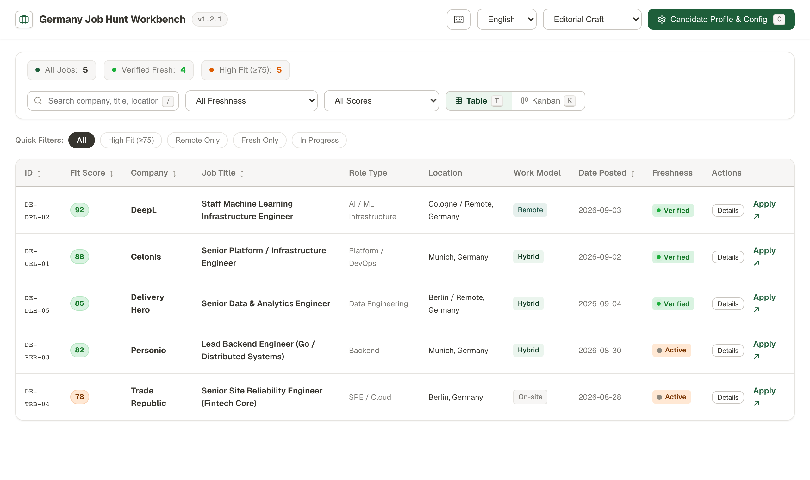

# 🇩🇪 job-search-de

让 AI 助手帮你找德国职位、对照简历分析匹配度，并用浏览器工作台跟踪投递。适用于不同职业方向，以 Skill 形式运行在你的 AI 编程助手中。

[English](../README.md) · [Deutsch](README_de.md) · [中文](README_zh.md) · [日本語](README_ja.md) · [한국어](README_ko.md)

## 快速上手

准备一个能加载 Skill、执行命令的 AI 助手，以及网络连接和 Python 3。下面的安装命令还需要 Node.js/npm（`npx`）。本项目不需要额外的大模型 API Key；AI 助手本身的费用仍按其规则计算。

### 1. 安装

```bash
npx skills add Kevoyuan/job-search-de -g
```

按安装提示选择你使用的 AI 助手。如果安装后没有识别到 Skill，重启助手或新建会话。

<details>
<summary>手动安装方式</summary>

将仓库克隆到你的助手使用的 Skill 目录。对于读取 `~/.agents/skills/` 的助手：

```bash
git clone https://github.com/Kevoyuan/job-search-de.git ~/.agents/skills/job-search-de
```

如果助手使用其他目录，请替换命令中的目标路径。

</details>

### 2. 提供简历

在 AI 助手中打开一个用于求职的文件夹，上传简历，或告诉它简历路径，例如 `./resume.pdf`、`./CV.md`。

还没准备好简历？可以先描述工作经历和求职偏好，也可以只找职位，暂不做个人匹配评分。

### 3. 复制这段话开始搜索

替换岗位、城市和简历路径即可：

```text
请使用 job-search-de，我的简历在 ./resume.pdf。
帮我找柏林或德国境内远程的软件工程师岗位，
优先英语工作环境、最近 14 天发布的职位。
生成中文匹配报告和求职工作台。
```

助手会提取简历信息、补充询问缺失的偏好，搜索企业招聘页面，核查职位状态和日期，再根据简历证据分析匹配度。

## 你会得到什么

- **职位清单**：官方投递链接、工作地点和时效标记；无法确认的日期会注明未知。
- **匹配报告**：适合的理由、能力差距，以及对应的简历证据。
- **求职工作台**：用浏览器打开生成的 `job-hunt-workbench.html`，筛选职位、切换表格或看板、记录投递进度。支持五种主题和中英德三种界面语言。



未经你明确授权，助手不会提交申请或联系雇主。

## 日常怎么用

加载 Skill 后，在助手对话里直接说需求，或使用下面的快捷指令。这些不是终端命令；如果助手占用了斜杠指令，改用自然语言即可。

| 想做什么 | 输入示例 |
|---|---|
| 找新职位 | `/refresh`，或“按已保存的偏好找一批新职位” |
| 评估一个岗位 | `/match <职位链接或岗位描述>` |
| 定制简历和求职信 | `/tailor <职位 ID 或链接>` |
| 查看近期精选 | `/digest` |
| 更新 Skill | `/update-skill`，或在终端执行 `npx skills update job-search-de -g` |
| 同步到 Notion | `/sync`，需要先配置 Notion 集成 |

## 修改求职偏好

直接告诉助手即可，例如：

> 把慕尼黑也加进搜索范围，排除高级岗位，工作台改成德语。

助手会把档案和偏好保存在求职文件夹内的 `.job-search/` 中，你不需要手动编写配置。

| 文件 | 用途 |
|---|---|
| `profile.md` | 已确认的经历、技能和资质 |
| `preferences.md` | 目标岗位、城市、语言和排除条件 |
| `settings.ini` | 搜索时间范围、评分阈值和输出语言 |

需要手动调整设置或自定义公司、关键词列表时，查看[配置指南](../references/configuration.md)。

## 让 Skill 保持最新

工作台在构建时和打开时都会自动检查新版本。一旦发现新版本，顶部会弹出提示条，并附上两条更新命令的一键复制按钮。点击头部的书本图标（或按 `G`）打开**使用说明**，可以查看当前已安装版本、手动重新检查并复制更新命令。

在助手对话中：

```text
/update-skill
```

或在终端直接执行：

```bash
npx skills update job-search-de -g
```

只想查看线上版本、不执行更新：

```bash
python3 scripts/check_update.py
```

## 数据与隐私

档案和配置文件保存在本地。AI 助手可能根据自身设置，将简历内容交给其模型服务商处理。职位搜索需要联网；启用 Notion 同步后，选定的数据会发送到 Notion。

职位状态反映搜索当时的检查结果，不能保证之后一直开放。

## 进一步了解

- [Skill 工作流程与指令](../SKILL.md)
- [匹配评分规则](../references/scoring.md)
- [交互式架构图](architecture.html)：下载后用浏览器打开
- [MIT 开源许可证](../LICENSE)
